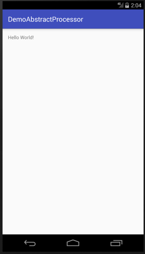

# AbstractProcessor Test Demo

`作者：Zyao89；转载请保留此行，谢谢；`

---

Java中的注解(Annotation)是一个很神奇的东西，特别现在有很多Android库都是使用注解的方式来实现的。
我们并不讨论那些在运行时（Runtime）通过反射机制运行处理的注解，而是讨论在编译时（Compile time）处理的注解。下面便入手学习下Java注解处理器。

### 基本概念
**注解处理器**是一个在javac中的，用来编译时扫描和处理的注解的工具。你可以为特定的注解，注册你自己的注解处理器。
注解处理器可以生成Java代码，这些生成的Java代码会组成 `.java` 文件，但不能修改已经存在的Java类（即不能向已有的类中添加方法）。而这些生成的Java文件，会同时与其他普通的手写Java源代码一起被javac编译。


### 抽象处理器 AbstractProcessor
> import javax.annotation.processing.AbstractProcessor;

我们每一个注解处理器都要继承于AbstractProcessor，如下所示：

```java
public class MyProcessor extends AbstractProcessor
{
    @Override
    public synchronized void init(ProcessingEnvironment processingEnvironment)
    {
        super.init(processingEnvironment);
    }

    @Override
    public boolean process(Set<? extends TypeElement> set, RoundEnvironment roundEnvironment)
    {
        return false;
    }

    @Override
    public Set<String> getSupportedAnnotationTypes()
    {
        return super.getSupportedAnnotationTypes();
    }

    @Override
    public SourceVersion getSupportedSourceVersion()
    {
        return super.getSupportedSourceVersion();
    }
}
```

* `init(ProcessingEnvironment processingEnvironment)`: 每一个注解处理器类都必须有一个空的构造函数。然而，这里有一个特殊的init()方法，它会被注解处理工具调用，并输入ProcessingEnviroment参数。ProcessingEnviroment提供很多有用的**工具类Elements,Types和Filer**。后面我们将看到详细的内容。
* `process(Set<? extends TypeElement> set, RoundEnvironment roundEnvironment)`: 这相当于每个处理器的主函数main()。你在这里写你的扫描、评估和处理注解的代码，以及生成Java文件。输入参数RoundEnviroment，可以让你查询出包含特定注解的被注解元素。后面我们将看到详细的内容。
* `getSupportedAnnotationTypes()`: 这里你必须指定，这个注解处理器是注册给哪个注解的。注意，它的返回值是一个字符串的集合，包含本处理器想要处理的注解类型的合法全称。换句话说，你在这里定义你的注解处理器注册到哪些注解上。
* `getSupportedSourceVersion()`: 用来指定你使用的Java版本。通常这里返回SourceVersion.latestSupported()。然而，如果你有足够的理由只支持Java 7的话，你也可以返回SourceVersion.RELEASE_7。我推荐你使用前者。

在Java 7以后，你也可以使用注解来代替getSupportedAnnotationTypes()和getSupportedSourceVersion()，像这样：

```java
@SupportedSourceVersion(SourceVersion.RELEASE_7)
@SupportedAnnotationTypes({
        "com.zyao89.ZyaoAnnotation"
})
public class MyProcessor extends AbstractProcessor
{
    @Override
    public synchronized void init(ProcessingEnvironment processingEnvironment)
    {
        super.init(processingEnvironment);
    }

    @Override
    public boolean process(Set<? extends TypeElement> set, RoundEnvironment roundEnvironment)
    {
        return false;
    }
}
```

### 简单实践

1. 首先我们来创建一个 `@ZyaoAnnotation` 注解，后面我们将用这个注解来自动生成一个java文件。

我们先来看下 `@ ZyaoAnnotation ` 注解：
```java
@Target({ElementType.TYPE})
@Retention(RetentionPolicy.CLASS)
public @interface ZyaoAnnotation
{
    String name() default "undefined";

    String text() default "";
}
```

这时候我们可以在需要注解的类上增加我们的注解了，如：
```java
@ZyaoAnnotation(
        name = "Zyao",
        text = "Hello !!! Welcome "
)
public class MainActivity extends AppCompatActivity
{

    @Override
    protected void onCreate(Bundle savedInstanceState)
    {
        super.onCreate(savedInstanceState);
        setContentView(R.layout.activity_main);
    }
}
```

这时，注解都注解完了，那我们该怎么运行呢？请看下面。

### 处理器
这里我们通过代码加注释的方式，来一步步构建我们想要的处理器。代码如下：
```java
@AutoService(Processor.class)
public class MyProcessor extends AbstractProcessor
{
    private Types    mTypeUtils;
    private Elements mElementUtils;
    private Filer    mFiler;
    private Messager mMessager;

    @Override
    public synchronized void init(ProcessingEnvironment processingEnvironment)
    {
        super.init(processingEnvironment);

        //初始化我们需要的基础工具
        mTypeUtils = processingEnv.getTypeUtils();
        mElementUtils = processingEnv.getElementUtils();
        mFiler = processingEnv.getFiler();
        mMessager = processingEnv.getMessager();
    }

    @Override
    public SourceVersion getSupportedSourceVersion()
    {
        //支持的java版本
        return SourceVersion.latestSupported();
    }

    @Override
    public Set<String> getSupportedAnnotationTypes()
    {
        //支持的注解
        Set<String> annotations = new LinkedHashSet<>();
        annotations.add(ZyaoAnnotation.class.getCanonicalName());
        return annotations;
    }

    @Override
    public boolean process(Set<? extends TypeElement> set, RoundEnvironment roundEnvironment)
    {
        //这里开始处理我们的注解解析了，以及生成Java文件
        return false;
    }
}
```

大家看到第一行`@AutoService(Processor.class)` 这个有木有？这是一个注解处理器，是Google开发的，用来生成META-INF/services/javax.annotation.processing.Processor文件的。

Gradle引入方式：
> compile 'com.google.auto.service:auto-service:1.0-rc2'

在`getSupportedAnnotationTypes()`中，我们指定本处理器将处理 `@ZyaoAnnotation` 注解。


### 基础工具解析

在init()中我们获得如下引用：

- **Elements**：一个用来处理Element的工具类，源代码的每一个部分都是一个特定类型的Element，例如：

```java
package com.example;    // PackageElement

public class Foo {        // TypeElement

    private int a;      // VariableElement
    private Foo other;  // VariableElement

    public Foo () {}    // ExecuteableElement

    public void setA (  // ExecuteableElement
                     int newA   // TypeElement
                     ) {}
}
```
举例来说，假如你有一个代表public class Foo类的TypeElement元素，你可以遍历它的孩子，如下：
```java
TypeElement fooClass = ... ;  
for (Element e : fooClass.getEnclosedElements()){ // iterate over children  
    Element parent = e.getEnclosingElement();  // parent == fooClass
}
```
TypeElement并不包含类本身的信息。你可以从TypeElement中获取类的名字，但是你获取不到类的信息，例如它的父类。这种信息需要通过TypeMirror获取。你可以通过调用elements.asType()获取元素的TypeMirror。


- **Types**：一个用来处理TypeMirror的工具类；（后面会使用到，在进行讲解）

- **Filer**：正如这个名字所示，使用Filer你可以创建文件。


### 搜索@ZyaoAnnotation注解
```
    @Override
    public boolean process(Set<? extends TypeElement> set, RoundEnvironment roundEnvironment)
    {//这里开始处理我们的注解解析了，以及生成Java文件

        // 遍历所有被注解了@Factory的元素
        for (Element annotatedElement : roundEnvironment.getElementsAnnotatedWith(ZyaoAnnotation.class)) {
            ...
        }


        return false;
    }
```

`roundEnvironment.getElementsAnnotatedWith(ZyaoAnnotation.class)`返回所有被注解了@Factory的元素的列表。你可能已经注意到，我们并没有说“所有被注解了@Factory的类的列表”，因为它真的是返回Element的列表。请记住：Element可以是类、方法、变量等。所以，接下来，我们必须检查这些Element是否是一个类：

```java
// 遍历所有被注解了@Factory的元素
        for (Element annotatedElement : roundEnvironment.getElementsAnnotatedWith(ZyaoAnnotation.class)) {
            // 检查被注解为@Factory的元素是否是一个类
            if (annotatedElement.getKind() != ElementKind.CLASS) {
                error(annotatedElement, "Only classes can be annotated with @%s",
                        ZyaoAnnotation.class.getSimpleName());
                return true; // 退出处理
            }

            //解析，并生成代码
            analysisAnnotated(annotatedElement);
        }
```

这里就配合了`TypeMirror`使用`EmentKind`或者`TypeKind`进行元素类型判断。

`error()`日志和错误信息打印：
```java
private void error(Element e, String msg, Object... args) {
        mMessager.printMessage(
                Diagnostic.Kind.ERROR,
                String.format(msg, args),
                e);
    }
```

除了`Diagnostic.Kind.ERROR`日志等级，还有其它，如：
```java
public static enum Kind {
        ERROR,
        WARNING,
        MANDATORY_WARNING,
        NOTE,
        OTHER;

        private Kind() {
        }
    }
```

### 代码生成
编写解析和生成的代码格式：
```java
private static final String SUFFIX = "$$ZYAO";

private void analysisAnnotated(Element classElement)
    {
        ZyaoAnnotation annotation = classElement.getAnnotation(ZyaoAnnotation.class);
        String name = annotation.name();
        String text = annotation.text();

//        TypeElement superClassName = mElementUtils.getTypeElement(name);
        String newClassName = name + SUFFIX;

        StringBuilder builder = new StringBuilder()
                .append("package com.zyao89.demoprocessor.auto;\n\n")
                .append("public class ")
                .append(newClassName)
                .append(" {\n\n") // open class
                .append("\tpublic String getMessage() {\n") // open method
                .append("\t\treturn \"");

        // this is appending to the return statement
        builder.append(text).append(name).append(" !\\n");


        builder.append("\";\n") // end return
                .append("\t}\n") // close method
                .append("}\n"); // close class


        try { // write the file
            JavaFileObject source = mFiler.createSourceFile("com.zyao89.demoprocessor.auto."+newClassName);
            Writer writer = source.openWriter();
            writer.write(builder.toString());
            writer.flush();
            writer.close();
        } catch (IOException e) {
            // Note: calling e.printStackTrace() will print IO errors
            // that occur from the file already existing after its first run, this is normal
        }

        info(">>> analysisAnnotated is finish... <<<");
    }
```
以上的连接字符串工作，可以使用`JavaPoet`开源库进行编写，提升效率。

```gradle
compile 'com.squareup:javapoet:1.7.0'
```

最后build一下工程，生成最终的java文件 `Zyao$$ZYAO.java` 

> 生成的文件路径：
/DemoAbstractProcessor/app/build/generated/source/apt/debug/com/zyao89/demoprocessor/auto/Zyao$$ZYAO.java

文件内容：

```java
package com.zyao89.demoprocessor.auto;

public class Zyao$$ZYAO {

	public String getMessage() {
		return "Hello !!! Welcome Zyao !\n";
	}
}
```

### 运行

```java
@ZyaoAnnotation(
        name = "Zyao",
        text = "Hello !!! Welcome "
)
public class MainActivity extends AppCompatActivity
{

    @Override
    protected void onCreate(Bundle savedInstanceState)
    {
        super.onCreate(savedInstanceState);
        setContentView(R.layout.activity_main);

    }

    public void changeText(View view) {
        Zyao$$ZYAO zyao$$ZYAO = new Zyao$$ZYAO();
        String message = zyao$$ZYAO.getMessage();
        ((TextView)view).setText(message);
    }
}
```

最终运行我们的程序，点击文本，可得到我们的`getMessage`内容。


### 演示图


---

`作者：Zyao89；转载请保留此行，谢谢；`
